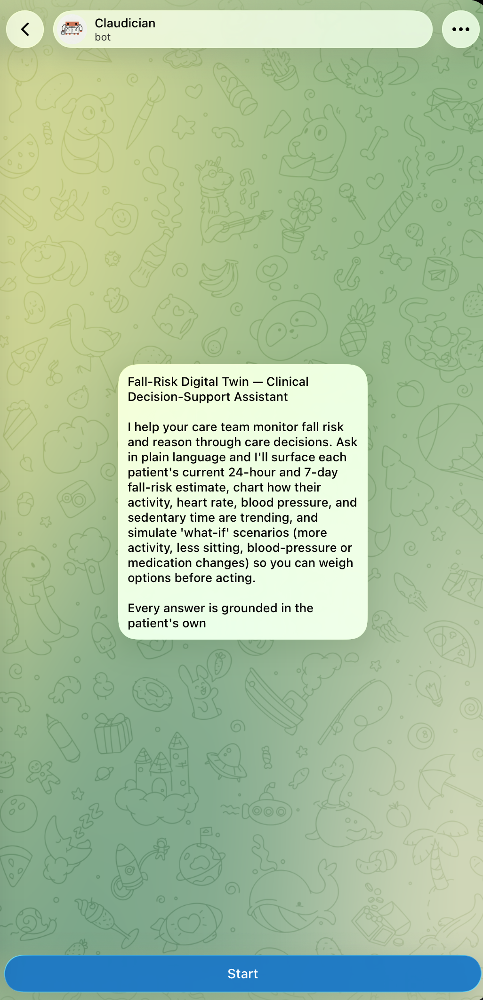
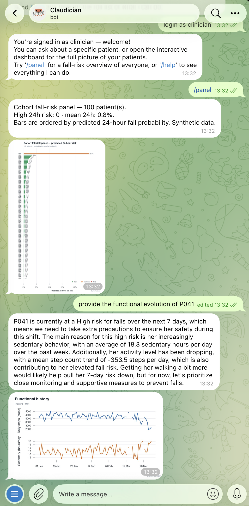
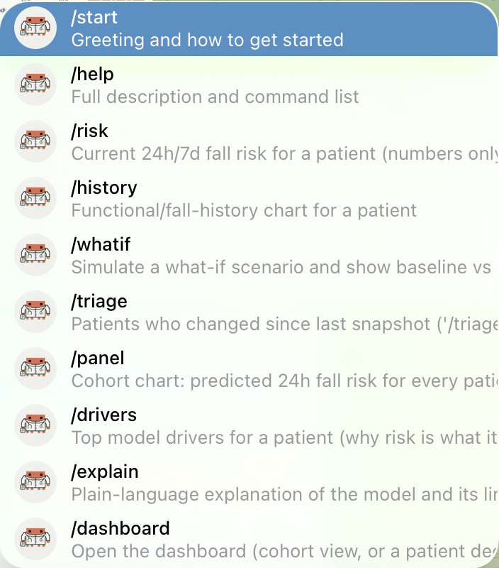
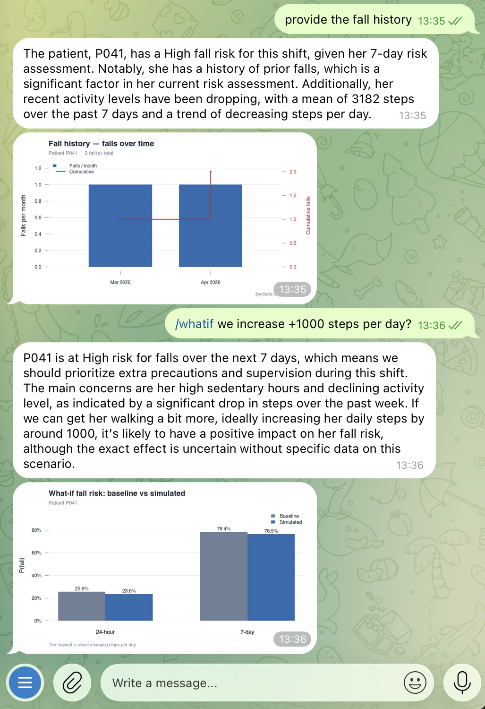
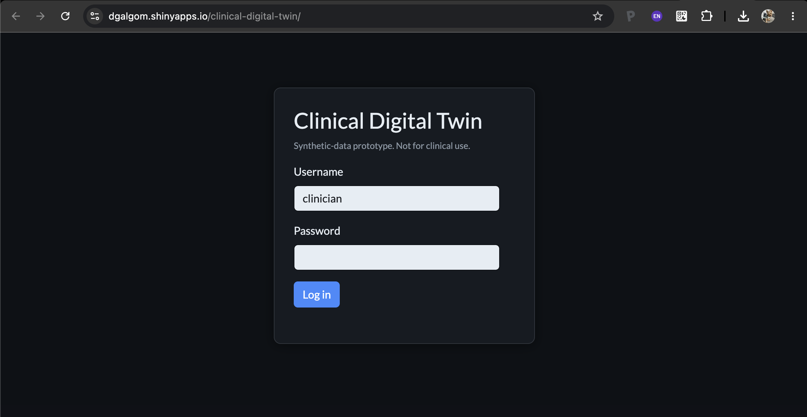
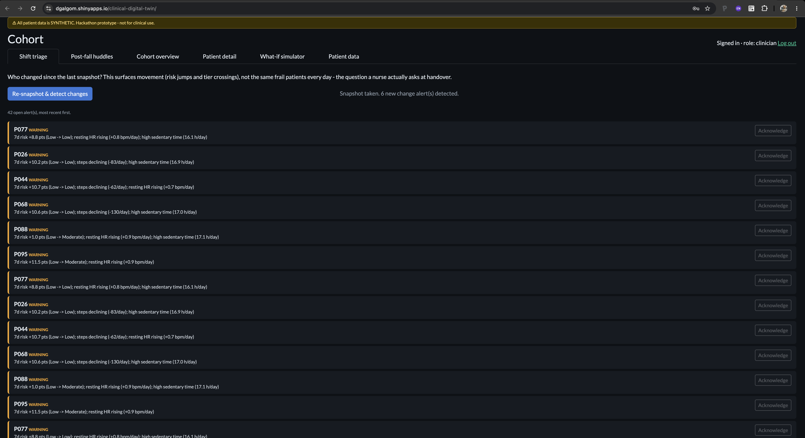
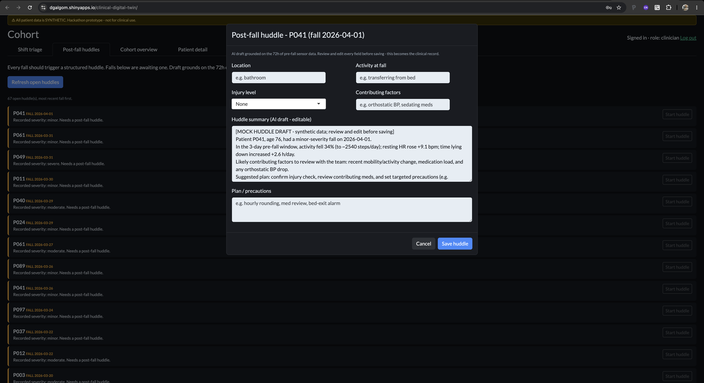
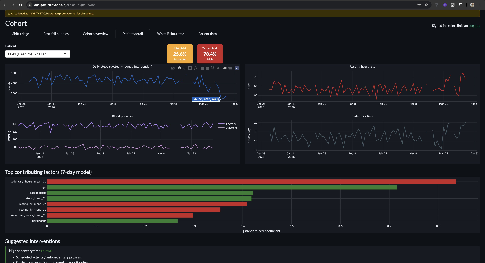
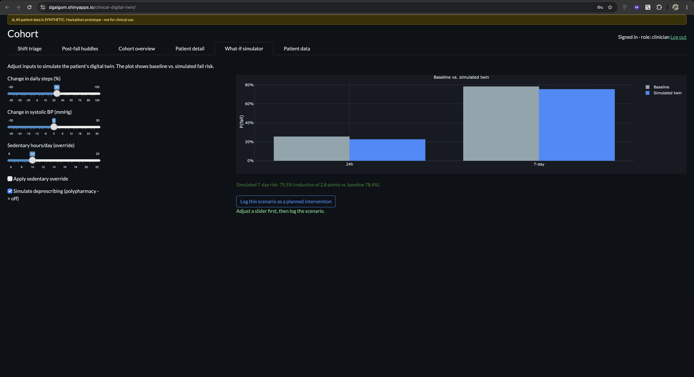
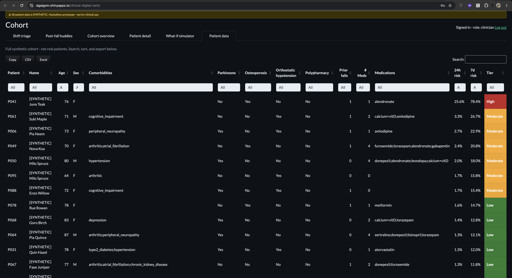

# Clinical Digital Twin Monitoring System

An end-to-end R system that lets clinicians visualize patient vitals/activity
data and run **"what-if" simulations on statistical digital twins** to estimate
fall risk over the next 24 hours and 7 days.

> ## ⚠️ Disclaimer
> **All patient data in this project is SYNTHETIC.** It is generated by
> `data-raw/generate_synthetic_data.R` using random distributions and contains
> **no real PHI**. This is a **hackathon prototype and is NOT for clinical use**,
> diagnosis, or treatment decisions. The auth layer is an MVP simplification, not
> production-grade security. See [Known limitations](#known-limitations).

## Why falls, and why this matters

Falls are the single most important safety event clinicians in older-adult
institutions are asked to watch for. In this population a fall is rarely
"just a fall": it is a potential inflection point in a resident's health
trajectory. A single fall can cause a hip fracture or a traumatic brain
injury, trigger a hospital admission, and set off a downward spiral of
immobilization, loss of independence, fear of falling, functional decline,
and death. Because frail older adults have little physiological reserve, the
adverse events that follow a fall are frequently **devastating and
irreversible** — which is exactly why early, continuous fall-risk monitoring
is worth the effort.

The burden at the population scale is enormous:

- **One in four** U.S. adults aged 65+ — over **14 million** people — reports
  falling each year, producing an estimated **9 million** fall injuries.
- Within institutions, a typical **100-bed nursing home reports 100–200 falls
  per year**, and residents average **~2.6 falls per person per year**.
- Roughly **1,800** nursing-home residents die from fall-related injuries
  annually; nursing-home residents are ~5% of adults 65+ but ~20% of fall
  deaths.
- The financial toll on patients, families, and payers is staggering:
  U.S. healthcare spending for **non-fatal** falls among older adults reached
  **~$80 billion in 2020** (most of it borne by Medicare), on top of
  **~$754 million** for fatal falls — and an individual hip-fracture episode
  routinely costs a patient and family **tens of thousands of dollars** in
  acute, rehabilitation, and long-term care.

A tool that helps a clinician see *which residents are trending toward a fall*
— and simulate *what would move the needle* — targets one of the highest-cost,
highest-harm problems in geriatric care. Sources:
[CDC — Facts About Falls](https://www.cdc.gov/falls/data-research/facts-stats/index.html),
[CDC — Falls in Nursing Homes](https://www.in.gov/health/files/CDC_Falls_in_Nursing_Homes.pdf),
[Healthcare spending for non-fatal falls, USA (2020)](https://pmc.ncbi.nlm.nih.gov/articles/PMC11445707/),
[Medical costs of fatal falls](https://pmc.ncbi.nlm.nih.gov/articles/PMC6089380/).

MIT-licensed. All code is original.

---

## What it does

- **Digital twin fall-risk model** — a **single** interpretable, ridge-penalized
  logistic regression predicting `P(fall)` at both the 24h and 7-day horizons via
  a **pooled discrete-time (pooled-logistic)** design: the horizon enters as a
  feature (`horizon_7d`), so one fitted object serves both horizons. Inputs are
  engineered sensor features (rolling means/trends of steps, resting HR,
  sedentary time, plus accelerometry mean vector magnitude) and static risk
  factors (age, Parkinson's, osteoporosis, orthostatic hypotension,
  polypharmacy, prior falls). One model → transparent coefficients, a favourable
  accuracy/complexity/latency trade-off, and single-dot-product prediction
  (~0.1 ms/call).
- **What-if simulator** — `predict_fall_risk(patient_id, modified_inputs)`
  accepts counterfactual overrides (e.g. "steps +20%", "new BP med lowers
  systolic 10 mmHg", "deprescribe to remove polypharmacy") and returns updated
  risk, side-by-side with baseline.
- **Clinician dashboard** (Shiny + plotly) — login → cohort overview by risk
  tier → patient detail (vitals/activity time series, risk cards, model drivers)
  → interactive what-if panel.
- **REST API** (plumber) — auth, cohort/patient queries, prediction, and a
  Telegram webhook.
- **Telegram bot** (Claude-powered) — clinicians ask e.g. *"How is patient P042
  trending?"* or *"What if we increase P042's mobility by 25%?"*. The webhook
  grounds a prompt with **real (synthetic) data and model outputs**, calls
  Claude, and replies. Runs in a deterministic **mock mode** with no keys.

**Live demo dashboard:**
<https://dgalgom.shinyapps.io/clinical-digital-twin/> — demo login
`clinician` / **`demo1234`**.

---

## How this was built 

This project was **designed, engineered, and refined end-to-end with Claude
Code** as the primary builder, inside a deliberate human-in-the-loop workflow.
The following maps our process onto the judging criteria.

### Claude Code as the primary engineer 

Every layer here — the pooled discrete-time logistic digital twin, the feature
engineering shared between training and inference, the SQLite schema and DBI
query layer, the Shiny + plotly dashboard, the plumber REST API, the Telegram
long-polling bot with its grounded/PII-safe prompt and deterministic mock
fallback, and the full test/verify/checkpoint harness — was written and
iterated with Claude Code. We pushed well past a "chatbot on top of a CSV":

- Claude Code built a **grounded visualization router** for the bot — a
  classify → grade → retry loop that maps free-text clinician questions onto a
  fixed taxonomy of renderable charts, with an offline deterministic fallback
  so the system is fully demonstrable **without any API key**.
- It engineered a **de-identification boundary**: the bot answers
  patient-data questions deterministically from the database (coded patient IDs
  only) and never sends synthetic names to the LLM.
- It kept the whole system **reproducible and offline-verifiable** — one
  `verify.R` command rebuilds data, trains the twin, exercises the API and bot
  in mock mode, and runs a statistical-adequacy checkpoint.

### A reinforcement loop with a second reasoning model 

To stress-test our own thinking, we ran a **critique-and-improve loop**: at
milestones we compacted the working context and handed that summary to
**Fable 5.0**, asking it for *deep, adversarial reasoning* about weaknesses,
edge cases, and design improvements. Fable 5.0's suggestions were then brought
back to **Claude Code, which implemented and validated them** — a lightweight
reinforcement loop where one model reasons about the design and the other
executes and verifies. Several concrete refinements (tighter what-if
grounding, the intent taxonomy, de-identification, and chart specificity) came
out of that loop.

### Validation, double-checking, and discussion 

We did not ship first drafts. The build proceeded as an explicit dialogue
between the human clinician-owner and Claude Code:

- **Clarify before coding.** Non-trivial features started with the human
  specifying intent and Claude Code asking targeted questions (which fields,
  which chart pairings, deterministic vs. LLM, sticky vs. per-message focus)
  *before* any file was touched.
- **Verify every change.** Each increment was checked three ways — the
  `testthat` unit suite, `tests/integration_check.R`, and the end-to-end
  `verify.R` — and, for charts, by rendering the PNG and **visually
  inspecting** it before committing.
- **Statistical adequacy, not just "it runs".** A held-out,
  patient-level split reports AUC, Brier, a calibration table, coefficient
  directionality, and per-prediction latency, and the checkpoint **exits
  non-zero** if any check regresses.
- **Honest scope.** Where the synthetic data-generating process makes a
  coefficient sign non-identifiable, we say so in the README and assert only
  the identifiable directions — craft over a demo-friendly overclaim.

### A working, compelling demo 

The system is **fully functional on synthetic data engineered to mirror the
characteristics of an older-adult institutional population**: a live deployed
dashboard, a running Telegram bot a clinician can message, daily cohort triage
(`/panel`), patient-specific trends and what-if simulation, event alerting, and
a structured post-fall huddle. See **[Screenshots](#screenshots)** for a guided
tour.

---

## The digital twin, briefly

`predict_fall_risk(model, feature_row, modified_inputs = NULL)` is the twin. With
`modified_inputs = NULL` it returns baseline risk; with a named list of
overrides it returns the counterfactual ("twin") risk. Supported overrides
include `steps_pct` (relative), `sbp_delta` (absolute mmHg change), and absolute
overrides for `steps_mean_7d`, `resting_hr_mean_7d`, `sedentary_hours_mean_7d`,
`polypharmacy`, trends, etc. (see `cdt_apply_overrides`).

**One pooled model, two horizons.** The prediction horizon is a feature
(`horizon_7d`): scoring a patient with the indicator at 0 gives the 24h risk and
at 1 gives the 7-day risk. This keeps the twin to a single interpretable object
with negligible latency — a deliberate accuracy/complexity/latency trade-off
suited to interactive what-if simulation.

**Interpretability:** logistic regression with standardized predictors means the
coefficients *are* the explanation. `cdt_feature_importance()` returns them
ranked by influence; on the demo cohort the top drivers are declining step
trend, rising resting-HR/sedentary trends, and lower mean steps — clinically
sensible directions.

> **On the static risk factors.** In the *synthetic* data-generating process,
> frailty (age, Parkinson's, prior falls, …) influences fall risk **only through**
> the sensor streams it shifts (fewer steps, higher resting HR, more sedentary
> time). Once those mediating sensor features are in the model, the static
> factors carry only confounded residual signal, so their fitted coefficient
> **signs are not identifiable** and should not be read clinically. The
> `checkpoints/evaluate_model.R` directionality check therefore asserts only the
> activity/vitals signs. This is a property of the simulation, not a model bug.

---

## Screenshots

A guided tour of the two clinician-facing surfaces — the **Telegram bot** (a
clinician's phone) and the **interactive deployed dashboard**. All data shown is
synthetic.

### Telegram bot

**Figure 1 — Bot landing page.** The assistant's welcome/onboarding screen.



**Figure 2 — `/panel` command.** The daily cohort triage the clinician is
expected to open every morning: one ranked bar per resident, colored by 24-hour
fall-risk tier.



**Figure 3 — Command menu.** The full list of bot commands.



**Figure 4 — Fall history + what-if for P041.** The resident with the highest
predicted fall probability: fall-history chart and a counterfactual simulation.



### Interactive dashboard

**Figure 5 — Dashboard landing page.** The login screen for the deployed Shiny
app. **For the demo, the password is `demo1234`.**



**Figure 6 — Alerts.** The list of alerts raised when a change/event is detected.



**Figure 7 — Post-fall huddle.** The structured information system used to
capture the details of a fall event.



**Figure 8 — Patient-specific panel.** A single resident's detail view.



**Figure 9 — What-if simulator.** The dashboard's interactive counterfactual
tab.



**Figure 10 — Full dataset.** The searchable table of all patient information
across the cohort.



---

## Architecture

```
                        ┌─────────────────────────────────────────────┐
                        │              R/  (core library)              │
                        │                                              │
  data-raw/             │  config · db · auth · ingest · features      │
  generate_synthetic_   │  synthetic_cohort · synthetic_sensors        │
  data.R  ───────────►  │  model (digital twin) · service              │
   (build cohort +      │  claude_client · telegram_client · bot       │
    sensors + train)    └───────┬───────────────┬───────────────┬──────┘
        │                       │               │               │
        ▼                       ▼               ▼               ▼
   ┌──────────┐          ┌────────────┐   ┌───────────┐   ┌───────────┐
   │  SQLite  │◄─────────│  app.R     │   │ api/       │   │ Telegram  │
   │ patients │          │  (Shiny +  │   │ plumber.R  │◄──│  webhook  │
   │ sensors  │          │   plotly)  │   │ (REST API) │   │ + Claude  │
   │ falls    │          └────────────┘   └───────────┘   └───────────┘
   │ users    │
   │ sessions │          fall_risk_model.rds  (persisted digital twin)
   └──────────┘
```

Front-ends (Shiny, plumber, bot) are thin; all logic lives in `R/` and is shared
via the `service` layer.

### Project layout

```
clinical-digital-twin/
├── R/                          # core library (package-style modules)
│   ├── config.R                # paths, schema, risk tiers
│   ├── db.R                    # SQLite schema + indexed queries
│   ├── auth.R                  # password hashing + session tokens
│   ├── ingest.R                # CSV -> canonical clinical schema
│   ├── synthetic_cohort.R      # synthetic patient generator
│   ├── synthetic_sensors.R     # wearable streams: BP/HR/accelerometry @06:00 CET
│   ├── features.R              # feature engineering (shared train/infer)
│   ├── model.R                 # digital twin: fit + predict_fall_risk()
│   ├── service.R               # combines db + model for front-ends
│   ├── claude_client.R         # Claude API (httr2) + mock mode
│   ├── telegram_client.R       # Telegram API (httr2) + mock mode
│   └── bot.R                   # conversation logic + prompt grounding
├── app.R                       # Shiny + plotly dashboard
├── api/
│   ├── plumber.R               # REST API + Telegram webhook
│   └── run_api.R               # API launcher
├── data-raw/
│   ├── generate_synthetic_data.R   # reproducibly builds everything
│   └── example_institution_patients.csv  # demo ingestion input (generated)
├── checkpoints/
│   └── evaluate_model.R        # statistical-adequacy checkpoint (AUC/Brier/...)
├── verify.R                    # one-command end-to-end verification (no keys)
├── tests/
│   ├── run_tests.R
│   ├── integration_check.R
│   └── testthat/               # unit tests (model + preprocessing + bot/auth)
├── data/                       # generated SQLite + model (git-ignored)
├── setup.R                     # install deps + build dataset
├── DESCRIPTION / LICENSE / README.md
└── .Renviron.example
```

---

## Setup

Requires **R ≥ 4.2**. From the project root:

```bash
Rscript setup.R
```

This installs dependencies (via `renv` if a lockfile is present, otherwise
`install.packages`) and runs `data-raw/generate_synthetic_data.R` to build the
SQLite database and train + persist the model.

<details>
<summary>Manual dependency install</summary>

```r
install.packages(c(
  "DBI", "RSQLite", "dplyr", "tidyr", "tibble", "lubridate",
  "jsonlite", "sodium",              # core
  "shiny", "plotly", "DT", "plumber", "httr2", "testthat"  # front-ends
))
```
</details>

### Dependency management (renv)

This project is set up to use [`renv`](https://rstudio.github.io/renv/). To pin
your environment after installing:

```r
renv::init()      # first time: creates renv.lock from installed packages
renv::snapshot()  # update the lockfile
```

`setup.R` will `renv::restore()` automatically if `renv.lock` exists.

> **Secrets** (Claude/Groq/Telegram keys) are read **only from the
> environment** and never hardcoded; copy `.Renviron.example` to `.Renviron`
> (git-ignored) to supply them. With no keys at all, the system runs fully in
> deterministic **mock mode**. The Telegram bot supports two interchangeable,
> equally-grounded LLM backends — **Claude** (default) and **Groq / Llama 3.3
> 70B** for lower latency — each degrading to the mock when its key is absent.

---

## How to run

Run each component from the project root in its own terminal.

### 1. Dashboard (Shiny + plotly)

```bash
Rscript -e "shiny::runApp('app.R', port=3838, launch.browser=TRUE)"
```

Open http://127.0.0.1:3838. **Demo login:** `clinician` / `demo1234`
(seeded by the data generator — for the demo only).

### 2. REST API + Telegram webhook (plumber)

```bash
Rscript api/run_api.R          # http://127.0.0.1:8000
```

Example:

```bash
# Login -> token
curl -s -X POST "http://127.0.0.1:8000/login" \
  -d "username=clinician&password=demo1234"

# Cohort snapshot (use the token from above)
curl -s "http://127.0.0.1:8000/cohort" -H "Authorization: Bearer <TOKEN>"

# What-if prediction (counterfactual in JSON body)
curl -s -X POST "http://127.0.0.1:8000/predict" \
  -H "Authorization: Bearer <TOKEN>" \
  -H "Content-Type: application/json" \
  -d '{"patient_id":"P048","modified_inputs":{"steps_pct":30,"sbp_delta":-10}}'
```

### 3. Telegram bot

The recommended way to run the bot is **long-polling** — no public URL, no
webhook. One process (`api/run_bot_poll.R`) opens a single outbound HTTPS
connection and consumes updates, feeding them to the same dispatcher the webhook
uses. First, run the one-off setup to publish the command menu + descriptions
and clear any stale webhook/queued updates, then start the poller:

```bash
Rscript api/setup_telegram.R     # setMyCommands + setMyDescription + deleteWebhook
Rscript api/run_bot_poll.R       # start the bot (long-polling); Ctrl-C to stop
```

`api/setup_telegram.R` is idempotent and safe to re-run. It registers the folded
**menu** button (sourced from `cdt_bot_commands()`, so the menu and `/help` never
drift), sets the empty-chat **description**, and calls `deleteWebhook` with
`drop_pending_updates=TRUE` so a fresh poller starts clean (Telegram allows
*either* a webhook *or* `getUpdates`, never both — a leftover webhook makes
`getUpdates` return HTTP 409).

With `GROQ_API_KEY` set the bot answers via Groq's Llama 3.3 70B (~0.3–0.8 s);
otherwise it uses Claude, and with no key at all it falls back to deterministic
mock replies. Then message the bot: *"How is patient P048 trending?"* or *"What
if we increase P048's mobility by 25%?"*.

> **Webhook route (future):** an always-on hosted deployment can serve the
> plumber webhook `POST /telegram/webhook` behind a public HTTPS URL and register
> it with `setWebhook`. That path is intentionally **not wired yet** — see the
> `setup_webhook = FALSE` placeholder in `api/setup_telegram.R`.

**Without keys**, run the offline integration check to see the same logic in mock
mode:

```bash
Rscript tests/integration_check.R
```

### 4. Tests

```bash
Rscript tests/run_tests.R
```

Covers preprocessing/ingestion, sensor simulation shape (BP/HR/accelerometry) and
06:00 CET/CEST timestamps, single-pooled-model structure + horizon monotonicity,
`predict_fall_risk` counterfactual direction, save/load round-trip, auth, and the
bot's parsing/grounding (mock).

### 5. Checkpoints (functional + statistical adequacy)

Two self-contained checkpoints let an external reviewer confirm the system works
and that the model's outputs are sensible — **no API keys or network required**.

```bash
# End-to-end: packages -> build data -> DB -> twin -> API -> bot (mock) -> stats.
Rscript verify.R

# Statistical adequacy only: patient-level held-out split reporting AUC, Brier,
# a calibration/reliability table, coefficient directionality, counterfactual
# direction, and single-prediction latency. Exits non-zero if any check fails.
Rscript checkpoints/evaluate_model.R
```

On the seeded demo cohort the held-out model scores **24h AUC ≈ 0.99**,
**7d AUC ≈ 0.84**, **7d Brier ≈ 0.036**, with all activity/vitals coefficient
signs in the clinically expected direction and **~0.1 ms** per prediction.

---

## Known limitations

- **Synthetic data only.** Distributions are illustrative, not
  epidemiologically calibrated. The model is trained on simulated fall labels.
- **MVP auth, not production security.** Session tokens are random hex with a
  fixed TTL; there is **no** CSRF protection, rate limiting, account lockout,
  password policy, or TLS enforcement in this code. A real deployment must add
  these and serve over HTTPS. Passwords are hashed with `sodium` (scrypt).
- **SQLite** is used for the hackathon. **Migration to Postgres:** swap the
  driver in `cdt_db_connect()` (`RPostgres::Postgres()`), adjust the
  `AUTOINCREMENT` columns to `SERIAL`/`IDENTITY`, and point `CDT_DB_PATH`-style
  config at a connection string. The DBI-based query layer is otherwise portable.
- **Daily-resolution sensors.** A single wearable read-out is modelled per day at
  **06:00 Europe/Berlin (CET/CEST)** — blood pressure, heart rate, and
  accelerometry (activity counts + mean vector magnitude) — mirroring a morning
  clinical routine. Higher-frequency streams are aggregated to these daily
  features; sub-daily modeling is out of scope for 48h.
- **Ingestion is simulated at build time, not live.** The intended data flow is:
  historical (synthetic) cohort → one wearable read-out per patient each morning
  at 06:00 CET → 24h/7d risk predictions off the full stored timeline → what-if
  simulation. The daily 06:00 cadence is faithfully encoded in the stored
  timestamps, but the **entire** span (start date … "today") is generated in a
  single build step (`data-raw/generate_synthetic_data.R`); there is **no live
  scheduler/cron** appending a fresh row each morning. `R/ingest_daily.R`
  (`cdt_append_daily()`) is a **placeholder** for a real institutional feed: it
  appends one new synthetic day per patient on demand, so the append path can be
  demonstrated and tested, but it is deliberately not wired to a scheduler and is
  not run during the build/`verify.R` (appending mutates the demo DB and would
  break checkpoint reproducibility).
- **Collinear features excluded by design.** Accelerometry *counts* are ~0.8
  correlated with the step summaries; feeding both near-duplicate activity
  measures into the ridge splits the shared signal and destabilizes coefficient
  signs, so only the near-orthogonal accelerometry *magnitude* enters the model.
  Counts are still ingested and stored.
- **The bot does not invent clinical facts** — it is grounded on injected data —
  but LLM output should still be reviewed; it is decision *support*, not a
  decision maker.
- **Model is not calibrated/validated** against real outcomes and reports
  uncalibrated probabilities; risk *tiers* are heuristic cutoffs.
- **No prospective / external validation.** Reported AUC/Brier come from a
  held-out split of the *same* synthetic generator; performance on real cohorts
  is unknown and would require prospective evaluation, recalibration, and
  fairness/subgroup analysis before any clinical consideration.
- **Single synthetic institution.** The cohort mirrors *one* older-adult
  institutional population; it does not capture between-site case-mix,
  care-pathway, or device-heterogeneity effects a multi-site deployment would
  face.
- **No uncertainty quantification (statistical models under the Bayesian framework).** One of the key characteristics in digital twins' construction is to be able of quantifying uncertainty around the estimate of interest. For illustration purposes, a logistic regression model was fitted; however, tests with `brms` + `marginaleffects` packages were successfully performed for next-generation applications.
- **Not a medical device.** Nothing here has been reviewed or cleared by any
  regulator (e.g. FDA); it must not be used to inform real patient care.


---

## Reproducibility

Everything downstream of `data-raw/generate_synthetic_data.R` is seeded. Judges
can rebuild the entire system from scratch:

```bash
Rscript setup.R        # or: Rscript data-raw/generate_synthetic_data.R
```

## License

MIT — see [LICENSE](LICENSE).
